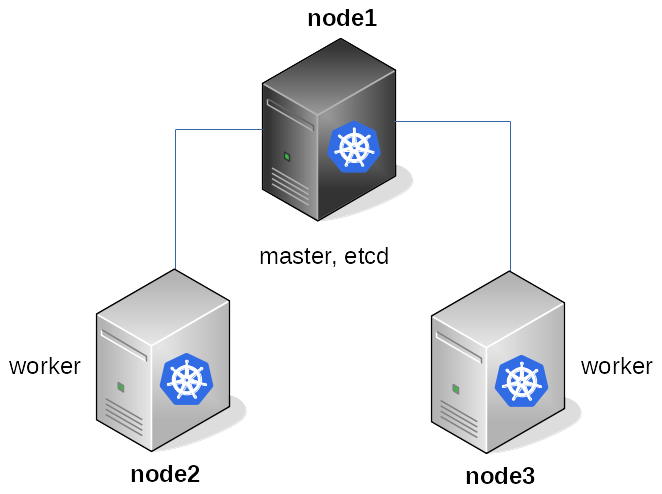
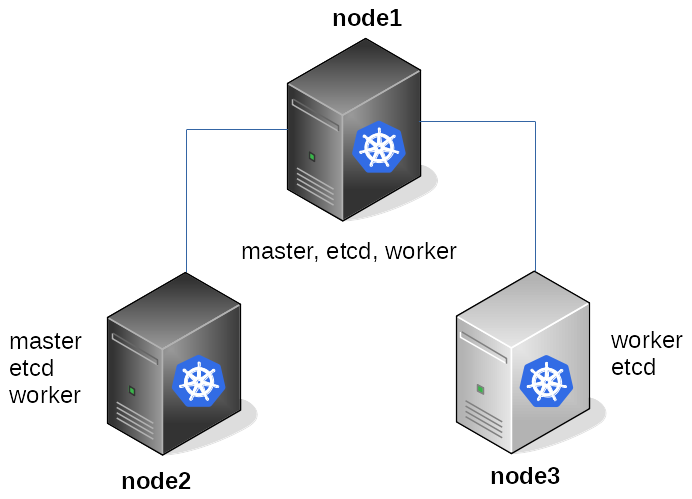

# Multinode Kubernetes Cluster

[](https://travis-ci.com/ruzickap/multinode_kubernetes_cluster)


Few scripts which may help you to quickly build Multinode Kubernetes cluster.
By running the scripts you got access to 4 node cluster running on VMs.

* [run-kubeadm.sh](run-kubeadm.sh) - is using standard "kubernetes tool" [kubeadm](https://github.com/kubernetes/kubeadm) for [creating the cluster](https://kubernetes.io/docs/setup/independent/create-cluster-kubeadm/)
* [run-kubespray.sh](run-kubespray.sh) - script is using [Kubespray](https://github.com/kubernetes-incubator/kubespray) to build enterprise ready cluster
* [run-kubeadm-demo.sh](run-kubeadm-demo.sh) - script showing Kubernetes basics using [demo-magic](https://github.com/paxtonhare/demo-magic) script
* [build_kubernetes_kubeadm-demo.sh](build_kubernetes_kubeadm-demo.sh) - demo script showing Kubernetes installation using [kubeadm](https://github.com/kubernetes/kubeadm) on Ubuntu 18.04
* [build_kubernetes_kubespray-demo.sh](build_kubernetes_kubespray-demo.sh) - demo script showing Kubernetes installation using [kubespray](https://github.com/kubernetes-incubator/kubespray) on Ubuntu 18.04

## Requirements

* [QEMU-KVM](https://en.wikibooks.org/wiki/QEMU/Installing_QEMU)
* [Vagrant](https://www.vagrantup.com/downloads.html)
* [Vagrant Libvirt Plugin](https://github.com/pradels/vagrant-libvirt)
* [Vagrant Host Manager Plugin](https://github.com/devopsgroup-io/vagrant-hostmanager)

Packages (+dependencies):

* git
* kubectl
* qemu-system-x86
* qemu-utils
* vagrant
* [vagrant-libvirt](https://github.com/vagrant-libvirt/vagrant-libvirt)
* [vagrant-hostmanager](https://github.com/devopsgroup-io/vagrant-hostmanager)

### Requirements installation

* Ubuntu 18.04

```bash
sudo apt install -y --no-install-recommends ansible curl dnsmasq ebtables git gcc jq libc-dev libvirt-bin libvirt-dev pkg-config pv qemu-kvm qemu-utils
VAGRANT_LATEST_VERSION=$(curl -s https://checkpoint-api.hashicorp.com/v1/check/vagrant | jq -r -M '.current_version')
curl https://releases.hashicorp.com/vagrant/${VAGRANT_LATEST_VERSION}/vagrant_${VAGRANT_LATEST_VERSION}_x86_64.deb --output /tmp/vagrant_x86_64.deb
sudo apt install -y /tmp/vagrant_x86_64.deb
rm /tmp/vagrant_x86_64.deb
vagrant plugin install vagrant-libvirt vagrant-hostmanager
sudo curl -L https://storage.googleapis.com/kubernetes-release/release/$(curl -s https://storage.googleapis.com/kubernetes-release/release/stable.txt)/bin/linux/amd64/kubectl --output /usr/local/bin/kubectl && sudo chmod a+x /usr/local/bin/kubectl
test -f $HOME/.ssh/id_rsa || ( install -m 0700 -d $HOME/.ssh && ssh-keygen -b 2048 -t rsa -f $HOME/.ssh/id_rsa -q -N '' )
sudo reboot
```

* Fedora 28

```bash
sudo dnf install -y ansible git kubernetes-client libvirt vagrant-libvirt vagrant-hostmanager
test -f $HOME/.ssh/id_rsa || ( install -m 0700 -d $HOME/.ssh && ssh-keygen -b 2048 -t rsa -f $HOME/.ssh/id_rsa -q -N '' )
service libvirtd restart
```

## Login Credentials

* Username: root / vagrant
* Password: vagrant

## Usage

Make sure your system meet all requirements.
For Ubuntu Xenial (16.04) you can see the installation details here: [.appveyor.yml](https://github.com/ruzickap/multinode_kubernetes_cluster/blob/57872864d3ab3b23013baebf3ef7269a7dd078a1/.appveyor.yml)

Simply run one of the commands `run-kubeadm.sh` or `run-kubespray.sh` and wait for few minutes.

You can see the example of scripts executions here:

* `run-kubeadm.sh`

[](https://asciinema.org/a/174963)

* `run-kubespray.sh`

[](https://asciinema.org/a/174965)

* `run-kubeadm-demo.sh`

[](https://asciinema.org/a/177189)

Once you installed the cluster use these commands to test your connection:

```bash
export KUBECONFIG=$PWD/kubeconfig.conf

kubectl get nodes
kubectl get pods --all-namespaces
kubectl cluster-info
```

## Demo asciinema examples

* `build_kubernetes_kubeadm-demo.sh`

[](https://asciinema.org/a/184410)

* `build_kubernetes_kubespray-demo.sh`

[](https://asciinema.org/a/184411)

## Diagrams

* `build_kubernetes_kubeadm-demo.sh`



* `build_kubernetes_kubespray-demo.sh`



## Documentation with CI

* You can find the documentation here: [https://multinode-kubernetes-cluster.readthedocs.io/en/latest/](https://multinode-kubernetes-cluster.readthedocs.io/en/latest/)
* Appveyor CI checking the commands in docs: [https://ci.appveyor.com/project/ruzickap/multinode-kubernetes-cluster](https://ci.appveyor.com/project/ruzickap/multinode-kubernetes-cluster)
* Presentation: [https://slides.com/ruzickap/kubernetes_installations/](https://slides.com/ruzickap/kubernetes_installations/)

## License

MIT / BSD

## Author Information

Scripts were created in 2018 by <petr.ruzicka@gmail.com>
